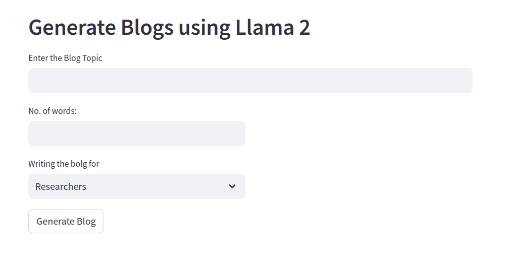

## Project Overview: Building an End-to-End Blog Generation Application with llama 2

In this code, we delve into the process of creating a project centered around the open-source llama 2 model, developed by Facebook (Meta), for the purpose of generating blogs using generative AI techniques. Below are the highlights of what this tutorial covers:

### Blog Generation Application

This segment focuses on the practical implementation aspect of the project. We demonstrate the creation of a blog generation application, which involves utilizing technologies:
* llama 2 model
* sentence-transformers
* ctransformers
* langchain
* streamlit

#### How UI looks

### Key Features of the Application

We showcase the various features integrated into the application, including input fields for specifying blog topics, desired writing style, and word count. Additionally, we explore the utilization of prompt templates for generating blog content tailored to user preferences.

### Execution and Deployment

The project is executed in a local environment using Python and CPU resources.

###### Author
- Jazay Ahmad